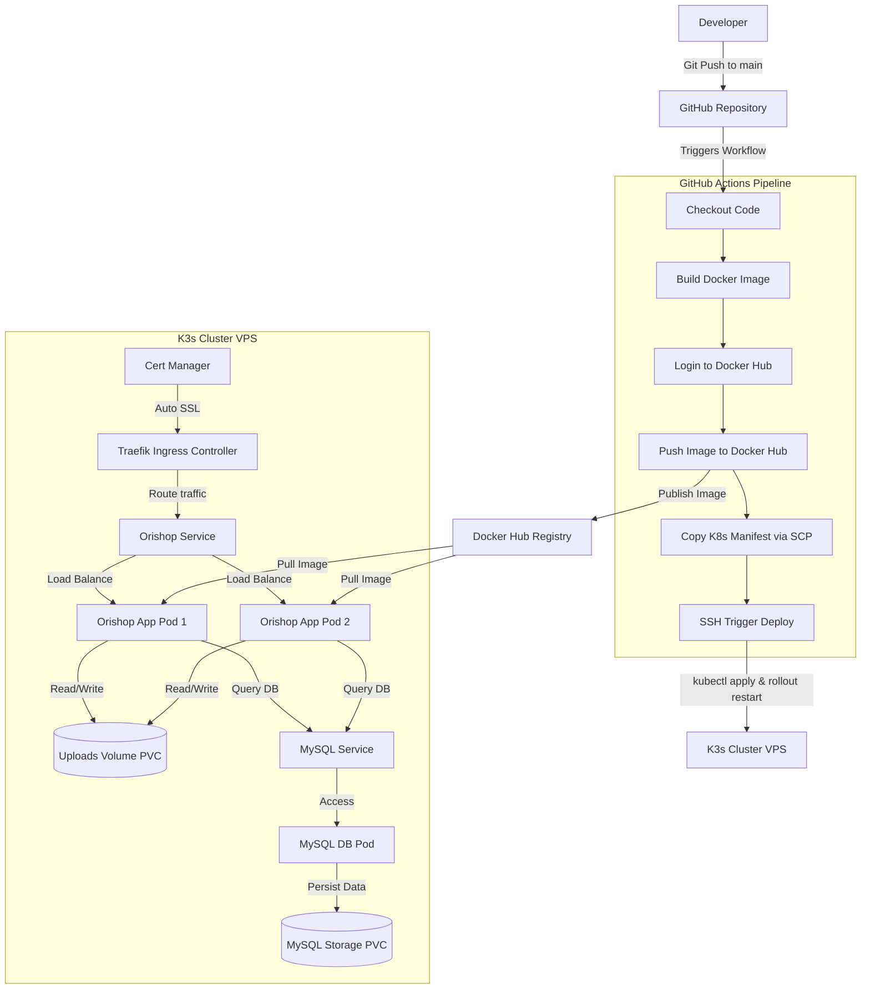

# BÁO CÁO TRIỂN KHAI HỆ THỐNG CI/CD VÀ DEPLOYMENT
## HỆ THỐNG THƯƠNG MẠI ĐIỆN TỬ ORISHOP

Tài liệu này trình bày chi tiết quy trình thiết lập, cấu hình và vận hành hệ thống tích hợp và triển khai liên tục (CI/CD) cho dự án Orishop, sử dụng tổ hợp công nghệ: **GitHub Actions**, **Docker Hub**, và **K3s (Kubernetes tối giản)** trên máy chủ ảo cá nhân (VPS).

---

## 1. Kiến trúc Triển khai (Deployment Architecture)

Hệ thống được thiết kế theo mô hình tự động hóa toàn phần từ bước đẩy mã nguồn lên kho lưu trữ cho đến khi ứng dụng chạy thực tế trên môi trường Production:



---

## 2. Docker hóa Ứng dụng (Containerization)

Ứng dụng Spring Boot được đóng gói thành Docker Image sử dụng cơ chế **Multi-stage Build** trong Dockerfile nhằm tối ưu hóa dung lượng ảnh đầu ra và nâng cao tính bảo mật.

### Chi tiết cấu hình Dockerfile
```dockerfile
# Giai đoạn 1: Build mã nguồn sử dụng Maven
FROM public.ecr.aws/docker/library/maven:3.9.4-eclipse-temurin-17 AS builder
WORKDIR /app
COPY pom.xml .
COPY src ./src
# Biên dịch gói .jar và bỏ qua unit tests để tăng tốc pipeline
RUN mvn clean package -DskipTests

# Giai đoạn 2: Tạo runtime image siêu nhẹ
FROM public.ecr.aws/docker/library/eclipse-temurin:17-jre-alpine
WORKDIR /app
# Sao chép file thực thi từ giai đoạn build
COPY --from=builder /app/target/*.jar app.jar
# Cổng mạng ứng dụng lắng nghe bên trong container
EXPOSE 8091
ENTRYPOINT ["java", "-jar", "app.jar"]
```

> **Lưu ý:** Việc sử dụng base image từ **AWS Public ECR** giúp tránh tình trạng bị giới hạn lượt tải (Rate Limit) thường gặp của Docker Hub khi thực hiện xây dựng ảnh trên các runner công cộng của GitHub.

---

## 3. Cấu hình Tài nguyên trên Kubernetes (K3s Manifests)

Hệ thống K3s trên VPS quản lý các tài nguyên của Orishop thông qua hai tệp tin Manifest chính: cấu hình Cơ sở dữ liệu và cấu hình Ứng dụng.

### 3.1. Cấu hình Cơ sở dữ liệu (`orishop-mysql.yaml`)

Tệp cấu hình này chịu trách nhiệm khởi tạo cơ sở dữ liệu MySQL 8.0, cấu hình lưu trữ lâu dài (Persistent) và mở cổng giao tiếp nội bộ trong cụm K3s.

Cấu hình gồm 3 thành phần chính:
1. **PersistentVolumeClaim (PVC)**: Khai báo ổ đĩa ảo dung lượng **5Gi** để lưu trữ tệp dữ liệu của MySQL, đảm bảo dữ liệu không bị mất khi Pod hoặc node khởi động lại.
2. **Deployment**: Định nghĩa container chạy MySQL `mysql:8.0.28`. Cấu hình biến môi trường khởi tạo mật khẩu Root (`MYSQL_ROOT_PASSWORD`) và tên database (`orishop`). Sử dụng tham số `--default-authentication-plugin=mysql_native_password` để đảm bảo Spring Boot kết nối tương thích.
3. **Service**: Dịch vụ nội bộ cổng `3306` cho phép các ứng dụng khác trong cụm kết nối tới DB qua tên định danh `orishop-mysqldb`.

---

### 3.2. Cấu hình Ứng dụng chính (`orishop-k8s.yaml`)

Đây là cấu hình cốt lõi để triển khai và định tuyến ứng dụng Orishop, bao gồm cơ chế tự động phục hồi, bảo mật cấu hình, và cấu hình SSL tự động.

Các thành phần kỹ thuật quan trọng:
* **Lưu trữ tệp tin tải lên (PVC - 1Gi)**: Khai báo volume `orishop-uploads-pvc` dùng chung để lưu các ảnh sản phẩm tải lên từ Admin.
* **Deployment (`orishop-deployment`)**:
  * **Replicas**: Cấu hình `2` bản sao chạy song song để chia tải và dự phòng lỗi (High Availability).
  * **Chiến lược cập nhật (RollingUpdate)**: Cấu hình `maxSurge: 1` và `maxUnavailable: 0` giúp hệ thống cập nhật phiên bản mới mà không gây gián đoạn dịch vụ (Zero Downtime).
  * **Bảo mật biến môi trường (Secrets)**: Lấy thông số kết nối Database (`DB_URL`, `DB_USER`, `DB_PASS`) trực tiếp từ Secret `orishop-db-secret` lưu trên K3s nhằm tránh lộ thông tin nhạy cảm.
  * **Giám sát sức khỏe (Probes)**:
    * `readinessProbe`: Kiểm tra trạng thái sẵn sàng nhận traffic của container sau 20 giây khởi động.
    * `livenessProbe`: Tự động khởi động lại container sau 30 giây nếu ứng dụng rơi vào trạng thái treo (Deadlock).
* **Service (`orishop-service`)**: Expose cổng `8091` của ứng dụng thành cổng `80` trong mạng nội bộ cụm K3s.
* **Ingress (`orishop-ingress`)**:
  * Sử dụng **Traefik Ingress Controller** (được tích hợp mặc định trong K3s) làm cổng tiếp nhận traffic bên ngoài.
  * Tích hợp với **Cert-Manager** thông qua Annotation `cert-manager.io/cluster-issuer: "letsencrypt-prod"` nhằm tự động yêu cầu, gia hạn chứng chỉ SSL miễn phí từ **Let's Encrypt** cho tên miền `orishop.quyenlt.com`.

---

## 4. Thiết lập GitHub Secrets (Bảo mật Pipeline)

Trước khi kích hoạt pipeline CI/CD, các thông tin định danh nhạy cảm phải được cấu hình trong mục **Settings > Secrets and variables > Actions** của kho lưu trữ GitHub:

| Tên Secret | Mô tả |
| :--- | :--- |
| `DOCKERHUB_USERNAME` | Tên tài khoản đăng nhập Docker Hub (ví dụ: `tobi1008`). |
| `DOCKERHUB_TOKEN` | Access Token được tạo từ tài khoản Docker Hub (khuyến nghị dùng Token thay vì mật khẩu gốc). |
| `VPS_HOST` | Địa chỉ IP Public của máy chủ VPS. |
| `VPS_USERNAME` | Tên người dùng SSH vào VPS (ví dụ: `root`). |
| `VPS_KEY` | Nội dung Khóa Private Key SSH tương ứng để truy cập VPS không cần mật khẩu. |

---

## 5. Quy trình CI/CD tự động (`deploy.yml`)

Luồng công việc của GitHub Actions được kích hoạt tự động mỗi khi có sự kiện `push` lên nhánh `main` hoặc được chạy thủ công thông qua tính năng `workflow_dispatch`.

### Các giai đoạn thực thi trong Pipeline:

1. **Khởi tạo môi trường (Setup)**:
   * Checkout mã nguồn mới nhất từ kho lưu trữ.
   * Cài đặt công cụ **Docker Buildx** hỗ trợ tối ưu việc xây dựng ảnh container.
2. **Xây dựng và Đóng gói (Build & Push)**:
   * Đăng nhập vào registry của Docker Hub.
   * Xây dựng Docker Image từ Dockerfile và gắn nhãn (tag):
     * `tobi1008/orishop:latest`: Phiên bản chạy chính thức trên máy chủ.
     * `tobi1008/orishop:v${{ github.run_number }}`: Phiên bản gắn số hiệu build để dễ dàng quay lui (Rollback) khi xảy ra sự cố.
     * Đẩy các ảnh này lên Docker Hub.
3. **Chuyển giao cấu hình (Delivery)**:
   * Sử dụng Action `appleboy/scp-action` để sao chép tệp cấu hình K8s `orishop-k8s.yaml` lên thư mục `~/orishop-deploy` trên VPS.
4. **Triển khai ứng dụng (Deployment)**:
   * Kết nối SSH vào VPS thông qua `appleboy/ssh-action`.
   * Tạo thư mục deploy nếu chưa tồn tại.
   * Chạy lệnh áp dụng cấu hình mới nhất:
     ```bash
     sudo kubectl apply -f orishop-k8s.yaml
     ```
   * Thực hiện khởi động lại ứng dụng có kiểm soát để cập nhật phiên bản ảnh Docker mới nhất:
     ```bash
     sudo kubectl rollout restart deployment/orishop-deployment
     ```

---

## 6. Hướng dẫn Vận hành & Giám sát Hệ thống trên VPS

Sau khi CI/CD chạy thành công, quản trị viên có thể sử dụng các lệnh sau trực tiếp trên VPS để kiểm tra trạng thái hoạt động:

### 6.1. Thiết lập cấu hình Secret ban đầu trên K3s
Trước khi deploy lần đầu, cần tạo Secret chứa thông tin Database trên cụm K3s bằng lệnh:
```bash
kubectl create secret generic orishop-db-secret \
  --from-literal=DB_URL="jdbc:mysql://orishop-mysqldb:3306/orishop?useSSL=false&allowPublicKeyRetrieval=true&serverTimezone=UTC" \
  --from-literal=DB_USER="root" \
  --from-literal=DB_PASS="03051008"
```

### 6.2. Kiểm tra trạng thái các tài nguyên
* Kiểm tra danh sách Pods đang chạy:
  ```bash
  sudo kubectl get pods -o wide
  ```
* Xem log thời gian thực của ứng dụng (hữu ích khi gỡ lỗi):
  ```bash
  sudo kubectl logs -f deployment/orishop-deployment --tail=100
  ```
* Kiểm tra trạng thái SSL / Ingress:
  ```bash
  sudo kubectl get ingress orishop-ingress
  sudo kubectl get certificate
  ```

### 6.3. Khắc phục sự cố nhanh (Troubleshooting)
* Rollback (quay lui) về phiên bản trước đó nếu bản cập nhật bị lỗi:
  ```bash
  sudo kubectl rollout undo deployment/orishop-deployment
  ```
* Kiểm tra mô tả chi tiết của một Pod gặp lỗi (ví dụ: CrashLoopBackOff):
  ```bash
  sudo kubectl describe pod <ten-pod-bi-loi>
  ```
